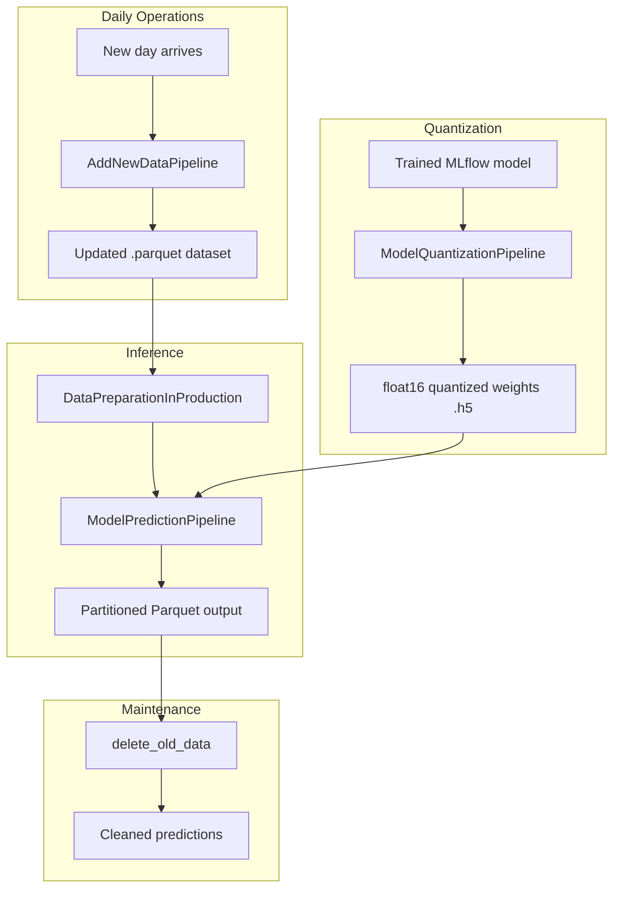

# Production Pipelines

Predap includes production pipeline classes in the `production/` directory for
operational deployment of trained models. Public documentation describes the
interfaces and contracts; real datasets, feature files, weights and prediction
outputs remain private.

For the toy-to-real replacement points, see
[Toy vs Real Integration Map](../platform/toy-vs-real-map.md).

---

## Pipeline Architecture



---

## 1. `AddNewDataPipeline`

**Module:** `production/add_new_data_pipeline.py`

Appends a new row of data to the existing dataset. When real-world data is not
yet available, it can use 3-year seasonal mean imputation, averaging values from
the same day/month across the three most recent years.

### Usage

```python
from production.add_new_data_pipeline import AddNewDataPipeline
from src.config.base_transformer_config import BaseTransformerConfig

config = BaseTransformerConfig()
pipeline = AddNewDataPipeline(config)

# Add a new row using seasonal imputation
updated_df = pipeline.add_new_data(
    new_data_path="data/full_CAT1.parquet",
    cutoff_date="2008-01-01",
    max_date="2025-09-30",
    eliminate_covid_data=False,
    covid_token=True,
    provided_data=None  # Use imputation; or pass a list of floats
)

# Save to disk
saved_path = pipeline.save_updated_data(
    df=updated_df,
    save_path="data/FINAL_DB1",
    save_name="full_CAT1",
    delete_old=True
)
```

### Imputation Logic

For each numeric column, the new value is computed as:

$$
\hat{x}_{\text{new}} = \frac{1}{3} \sum_{k=1}^{3} x_{k}
$$

If COVID data elimination is enabled, years 2020-2022 are excluded from the mean
calculation.

---

## 2. `DataPreparationInProduction`

**Module:** `production/data_preparation_in_poduction.py`

Base class providing data preparation methods tailored for production inference (not training). Prepares input sequences for each of the three model phases.

### Key Methods

| Method | Purpose |
|--------|---------|
| `prepare_prediction_univ_data()` | Create input sequences for univariate transformer |
| `prepare_prediction_diagnostics_data()` | Create input sequences with diagnostic covariates |
| `prepare_prediction_seasonal_data()` | Create input sequences with seasonal covariates |

---

## 3. `ModelPredictionPipeline`

**Module:** `production/model_reconstruction_pipeline.py`

Inherits from `DataPreparationInProduction`. Reconstructs trained model architectures from scratch, loads saved weights, generates predictions, and saves structured Parquet output.

### Key Methods

| Method | Purpose |
|--------|---------|
| `create_univariate_transformer_model()` | Rebuild Phase 1 architecture |
| `create_residual_transformer_model()` | Rebuild Phase 2/3 architecture |
| `load_model_weights()` | Load `.h5` weights into reconstructed model |
| `reconstruct_models_until_stage()` | Build and load only the stages needed by WAPE-based selection |
| `run_reconstruct_save_results_pipeline()` | Full pipeline across all horizons |
| `save_final_output_predictions()` | Save predictions as partitioned Parquet |
| `delete_old_data()` | Remove expired forecast rows |

### Usage

```python
import pandas as pd

from production.model_reconstruction_pipeline import ModelPredictionPipeline
from src.config.base_transformer_config import BaseTransformerConfig

config = BaseTransformerConfig()
pipeline = ModelPredictionPipeline(config)

# Run full reconstruction for configured forecast horizons
final_output_predictions = None
final_output_df = pd.DataFrame()
final_df = pipeline.run_reconstruct_save_results_pipeline(
    input_directory="private_runtime/data/historical_daily.parquet",
    old_input_directory="private_runtime/data/historical_daily.csv",
    code="J00",
    LOOKBACK_LIST=[7, 14, 60],
    FORECAST_LIST=[7, 14, 30],
    final_output_predictions=final_output_predictions,
    final_output_df=final_output_df,
)

# Save output
pipeline.save_final_output_predictions(
    final_df,
    output_path="private_runtime/production_predictions/real/final_output_predictions",
)
```

### Output Format

The final output follows the platform prediction-table contract:

| Column | Description |
|--------|-------------|
| `code` | Target code |
| `target_date` | Date being predicted |
| `init_forecast_date` | Date when the forecast was initialized |
| `final_forecast_date` | Last date covered by the forecast horizon |
| `forecast` | Forecast horizon |
| `lookback` | Lookback window |
| `predictions` | Predicted value |
| `ci_lower` | Lower confidence interval |
| `ci_upper` | Upper confidence interval |
| `velocity` | First-order trajectory metric |
| `acceleration` | Second-order trajectory metric |

---

## 4. `ModelQuantizationPipeline`

**Module:** `production/model_quantization_pipeline.py`

Inherits from `DataPreparationInProduction`. Loads trained models from MLflow, applies **float16 weight quantization**, evaluates the impact on prediction quality, and saves lightweight `.h5` weight files.

### Key Methods

| Method | Purpose |
|--------|---------|
| `load_mlflow_model()` | Load model from MLflow artifact store |
| `manual_weight_quantization()` | Convert all weights to `float16` |
| `evaluate_model()` | Compare quantized vs original predictions |
| `save_quantized_model_weights()` | Save quantized weights as `.h5` |
| `eval_quantization_impact()` | Report MSE/MAE degradation |

### Usage

```python
from production.model_quantization_pipeline import ModelQuantizationPipeline
from src.config.base_transformer_config import BaseTransformerConfig

config = BaseTransformerConfig()
pipeline = ModelQuantizationPipeline(config)

# Load from MLflow
model = pipeline.load_mlflow_model(run_id="abc123", artifact_path="univariate_transformer")

# Quantize
quantized_model = pipeline.manual_weight_quantization(model)

# Evaluate impact
pipeline.eval_quantization_impact(
    original_model=model,
    quantized_model=quantized_model,
    X_test=X_test,
    Y_test=Y_test
)

# Save weights
pipeline.save_quantized_model_weights(
    quantized_model,
    save_path="models/quantized/J00_base_transformer_7fh.h5"
)
```

### Why Quantize?

| Aspect | float32 (original) | float16 (quantized) |
|--------|-------------------|-------------------|
| Weight file size | ~2-5 MB | ~1-2.5 MB |
| Inference latency | Baseline | ~10-20% faster |
| Prediction quality | Baseline | < 0.1% MSE degradation (typical) |

---

## API Integration

All production pipelines are accessible via the FastAPI REST API:

| Endpoint | Pipeline |
|----------|----------|
| `POST /production/add_new_data` | `AddNewDataPipeline` |
| `GET /production/model_reconstruction_pipeline` | `ModelPredictionPipeline` |
| `DELETE /production/delete_old_data` | `ModelPredictionPipeline.delete_old_data()` |

See [REST API Reference](../api-reference/rest-api.md) for full endpoint documentation.
