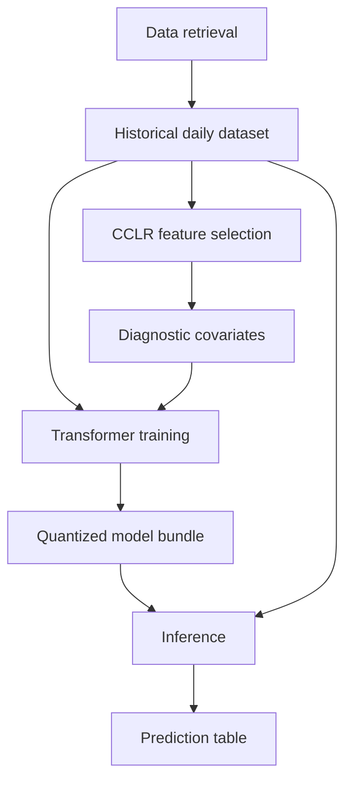

# PREDAP Platform

PREDAP is a modular, privacy-aware platform for healthcare demand forecasting.
It is designed to turn historical demand and diagnosis data into reproducible
forecasting pipelines while keeping real institutional data, trained model
weights and production outputs outside public GitHub repositories.

The project is split into independent modules for data retrieval, CCLR feature
selection, Transformer training, MLflow tracking, quantization and production
inference. Each module communicates through explicit file contracts so the
public toy workflow and the private real-data workflow stay aligned.

## Start Here

If this is your first time running the project, use the
[Practical Runbook](tutorials/practical-runbook.md). It is the linear guide that
goes from toy data to real retrieval outputs, MLflow, model recovery, training
`182_182` and `365_182`, validation, prediction and GitHub push.

Use these shorter pages only after you understand the full path:

| Need | Page |
|---|---|
| Clone from GitHub and place private folders | [Private Runtime Setup](platform/private-runtime-setup.md) |
| Run each split repo standalone | [Standalone Repositories](platform/standalone-repos.md) |
| Quick public sanity check | [5-Minute Quickstart](getting-started/quickstart.md) |
| Understand toy versus real substitutions | [Toy vs Real Integration Map](platform/toy-vs-real-map.md) |
| Start from retrieval `finals/` files | [Real Retrieval to Prediction](tutorials/real-retrieval-to-prediction.md) |
| Publish the split repositories | [GitHub to Production Check](tutorials/github-to-production-check.md) |

## Project Objectives

PREDAP aims to make healthcare demand forecasting easier to run, inspect and
share safely:

- standardize retrieval outputs into daily time-series tables;
- keep target-code metadata explicit and versionable;
- support CCLR diagnostic covariate selection;
- train Transformer models across configurable lookback and forecast horizons;
- log real experiments, metrics and artifacts in MLflow;
- export quantized model bundles for inference;
- validate model bundles before prediction;
- publish code and documentation without leaking private data.

## Intended Users

| User | What PREDAP helps with |
|---|---|
| Data engineers | Define retrieval outputs and keep private data in ignored runtime folders. |
| ML engineers | Train, quantify, compare and recover model artifacts with MLflow. |
| Analysts | Inspect toy contracts and real prediction outputs without reading the whole codebase. |
| Maintainers | Publish split GitHub repositories with safety checks and repeatable docs builds. |

## What PREDAP Is Not

PREDAP is not a public healthcare dataset, not a clinical decision system, not a
medical device and not a substitute for local validation, governance or human
review. It provides forecasting infrastructure; each organization remains
responsible for data access, privacy controls, model validation and operational
approval.

## Public Safety Boundary

No real healthcare data is published to GitHub. Public repos contain code,
documentation, CI configuration and synthetic fixtures only.

Keep these private:

- real clinical or institutional extracts;
- `.csv`, `.xlsx`, `.parquet`, database or archive files generated from real
  systems;
- MLflow run folders and artifacts;
- trained `.h5`, `.keras` or other model weights;
- production predictions;
- `.env` files, credentials and connection strings.

See [Data Policy](platform/data-policy.md) and
[License and Permitted Use](platform/license-and-use.md) before publishing.

## Platform Map

| Module | Responsibility | Public test artifact |
|---|---|---|
| Data retrieval | Build the historical daily dataset | Synthetic daily CSV |
| CCLR | Select diagnostic covariates | Synthetic feature contract |
| Training | Train and quantize Transformer models | Dummy model bundle |
| Inference | Load models and write predictions | Synthetic predictions CSV |

## Synthetic Smoke Test

```powershell
python examples/synthetic/predap_synthetic_workflow.py --output-dir runtime/synthetic_demo
python PREDAP_INFERENCE/production/validate_model_bundle.py --model-folder runtime/synthetic_demo/model_bundle
```

This validates the public workflow without private data.

## Real-Data Bootstrap

After cloning from GitHub, the first private step is to recreate the ignored
runtime tree and download/copy the private artifacts into it:

```powershell
powershell -NoProfile -ExecutionPolicy Bypass -File .\scripts\create_private_runtime_skeleton.ps1 -Profile platform
```

```text
private_runtime/data/
private_runtime/best_features/
private_runtime/quantized_models/
private_runtime/models_parameters/
private_runtime/transformer_outputs/
private_runtime/history/
private_runtime/results/
private_runtime/production_predictions/
```

The required file formats, names and validation commands are documented in
[Private Runtime Setup](platform/private-runtime-setup.md). Start there before
running real training or inference.

## Architecture



## Operating Model

There are two ways to run the project:

- **Toy path:** safe public workflow using deterministic synthetic data and
  dummy model bundles. Use it to learn contracts and validate GitHub CI.
- **Real path:** private workflow using ignored local folders, Docker, MLflow,
  real retrieval outputs, real CCLR features, trained models and prediction
  outputs.

The toy path explains what each handoff looks like. The real path replaces the
toy subprocesses with institutional data retrieval, real feature generation,
TensorFlow training and production inference.

## Contact and Governance

- Public questions and reproducible bugs: [Contact and Support](platform/contact-support.md).
- Security or data-exposure reports: follow `SECURITY.md` and use a private
  maintainer channel.
- Contributions: see `CONTRIBUTING.md`.
- License and use permissions: see [License and Permitted Use](platform/license-and-use.md).

## Core References

- [Repository Strategy](platform/repository-strategy.md)
- [Data Policy](platform/data-policy.md)
- [License and Permitted Use](platform/license-and-use.md)
- [Contact and Support](platform/contact-support.md)
- [Module Contracts](platform/module-contracts.md)
- [Private Runtime Setup](platform/private-runtime-setup.md)
- [External Model Inference](tutorials/external-model-inference.md)
